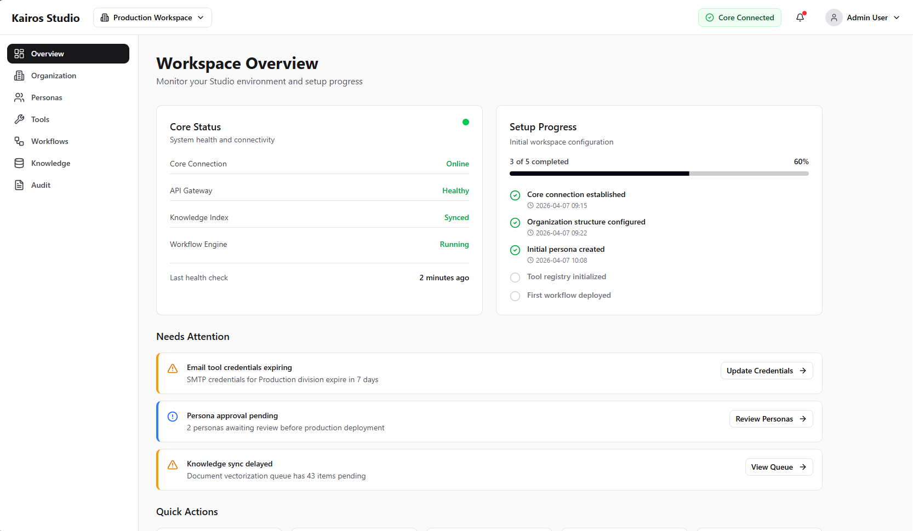
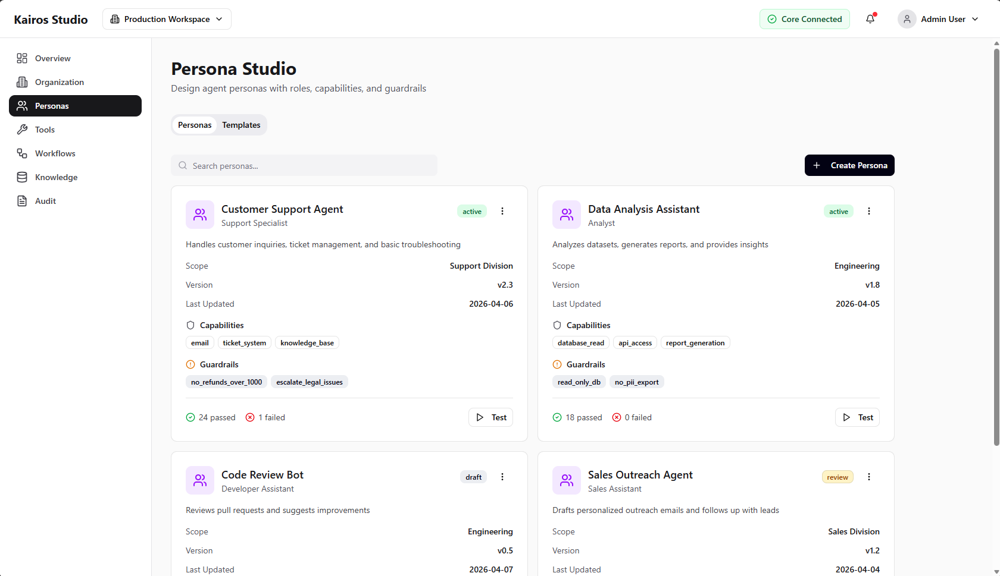
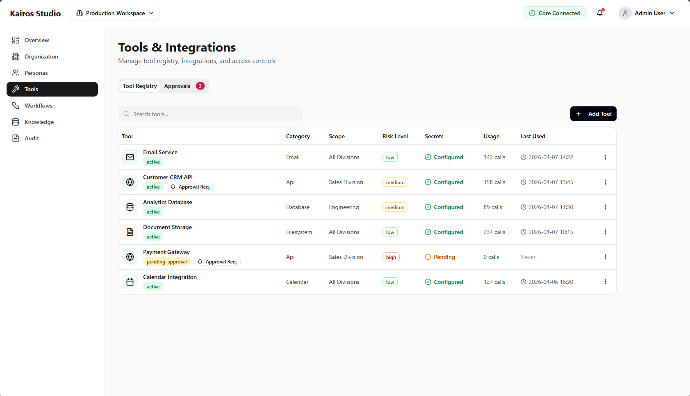
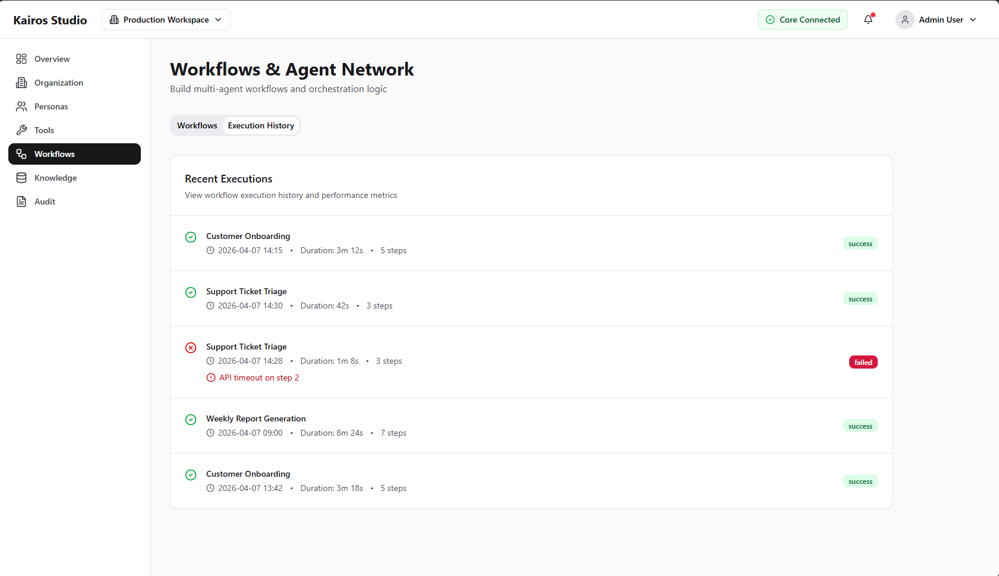
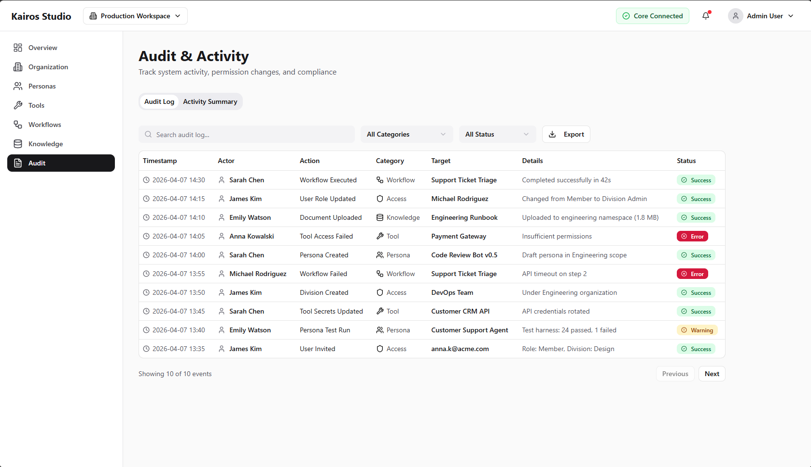

# 05 - Kairos Adoption Guide

This guide covers adoption in:

- `kairos-studio`
- `kairos-core` frontend/setup wizard surfaces

## Rollout order

1. Swap low-risk primitives (`Button`, `Input`, `Label`, `Card`)
2. Validate visual and interaction parity
3. Swap interaction-heavy components (`Dialog`, `DropdownMenu`, `Select`, `Tabs`, `Tooltip`)
4. Adopt `WizardTemplate` for setup/onboarding flows while keeping domain logic in app adapters

## Suggested PR strategy

- Keep one feature area per PR.
- Keep app wrappers for product defaults.
- Avoid adding app-specific props to shared primitives unless both apps need them.

## Studio screenshot references

Use these screenshots to anchor migration notes and visual checks:

See `./08-studio-screen-map.md` for component-level mapping examples tied to these screens.

## Verification checklist

- Build passes
- No boundary violations (no domain imports in `@kairosstack/ui`)
- Keyboard/focus states preserved
- Form behavior unchanged
- Visual drift reviewed
