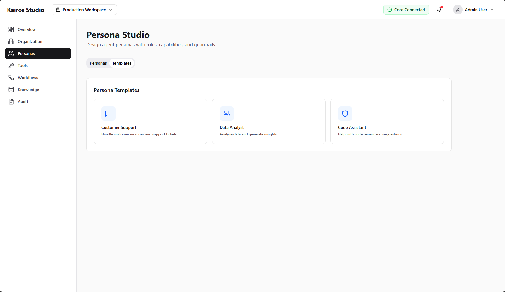
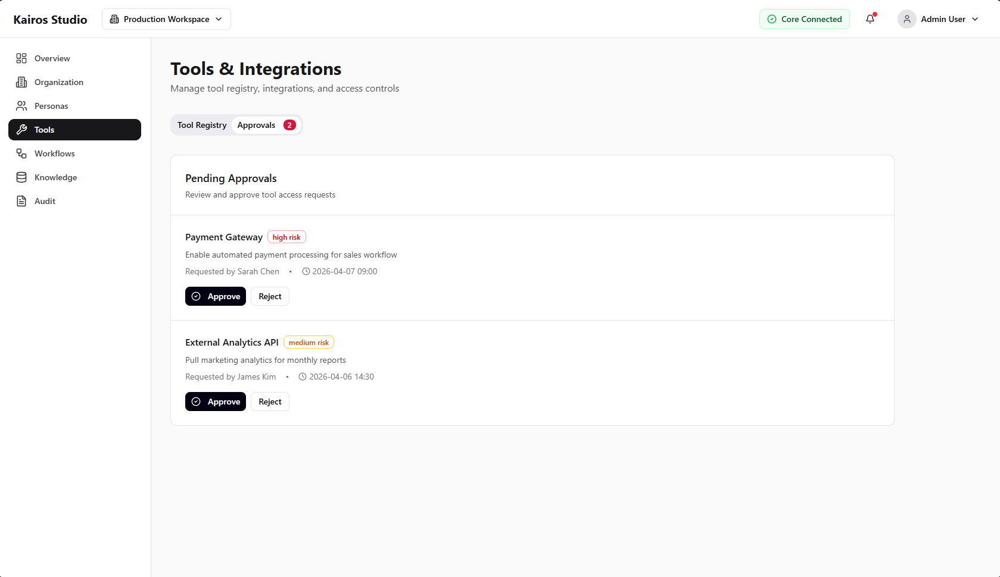
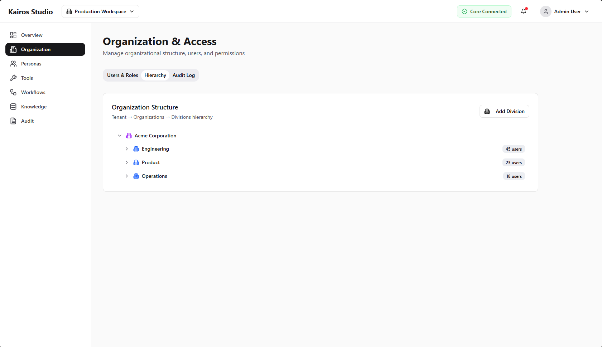
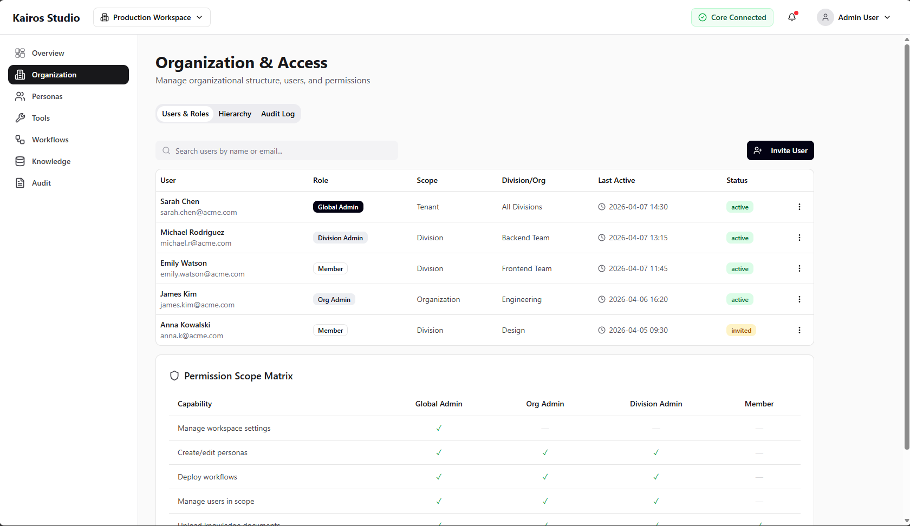
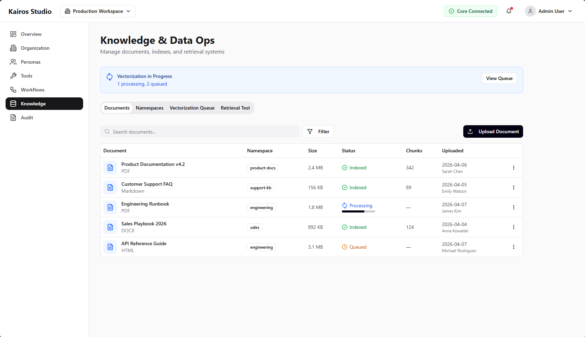
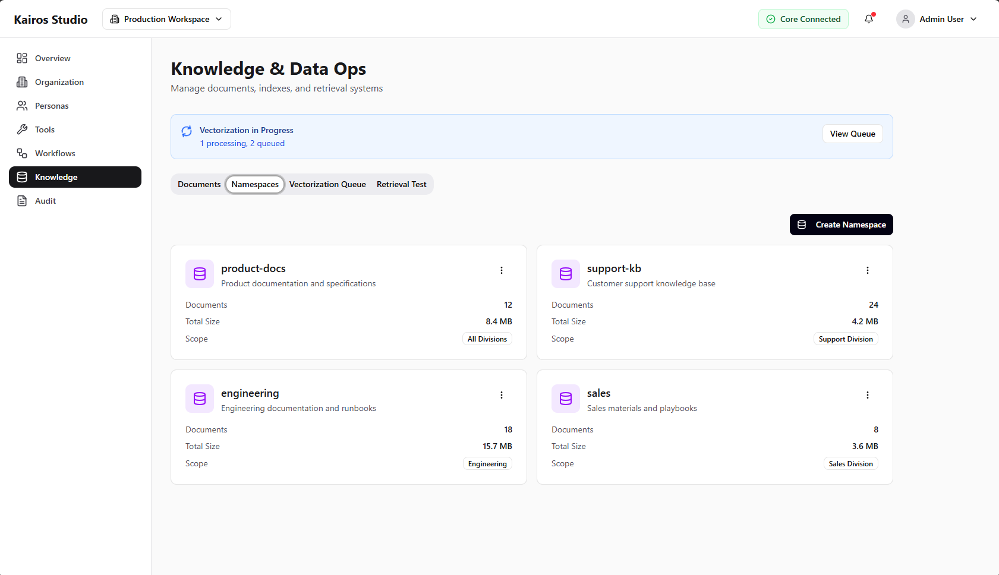
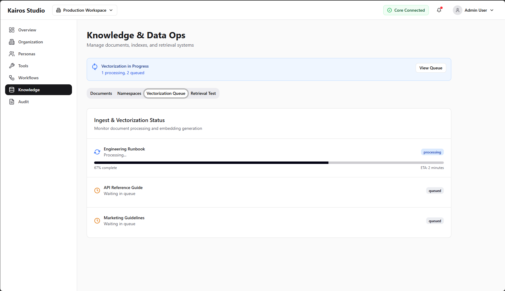
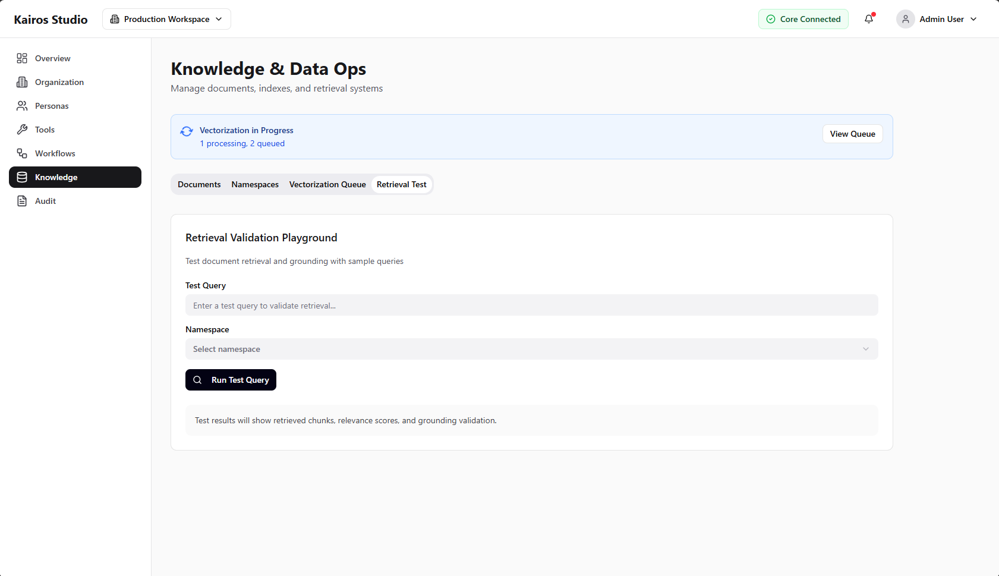
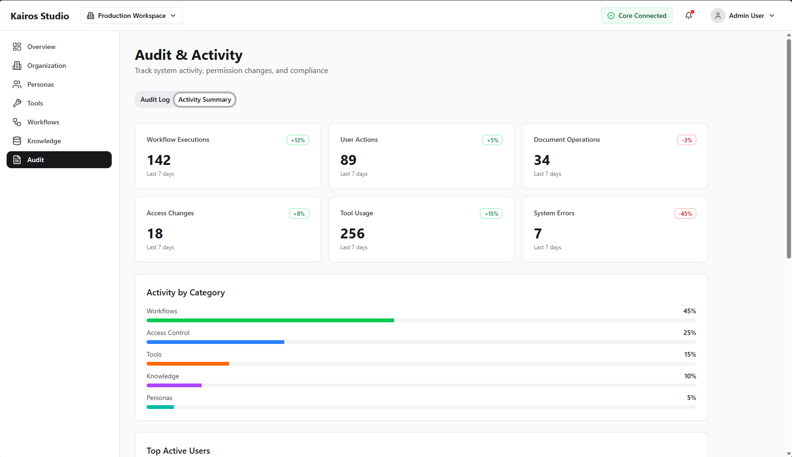

# 08 - Studio Screen Map

This page maps current `kairos-studio` screens to `@kairosstack/ui` component usage patterns.

Use it during migration to keep UI behavior consistent while replacing local components.

## Workspace overview

Common primitives used:

- `Card`, `CardHeader`, `CardContent`
- `Progress`
- `Badge`
- `Button`
- `Alert`
- `Separator`

## Persona creator/studio

Common primitives used:

- `Card`
- `Tabs`
- `Input`
- `Textarea`
- `Select`
- `Badge`
- `DropdownMenu`
- `Button`

## Tools and integrations

Common primitives used:

- `Table`
- `Badge`
- `Button`
- `Tabs`
- `Input`
- `DropdownMenu`

## Organization and access

Common primitives used:

- `Card`
- `Table`
- `Select`
- `Dialog`
- `Checkbox`
- `Switch`

## Knowledge operations

Common primitives used:

- `Tabs`
- `Card`
- `Table`
- `Progress`
- `Badge`
- `Button`

## Workflows and audit

Common primitives used:

- `Table`
- `Badge`
- `Dialog`
- `Tooltip`
- `Button`
